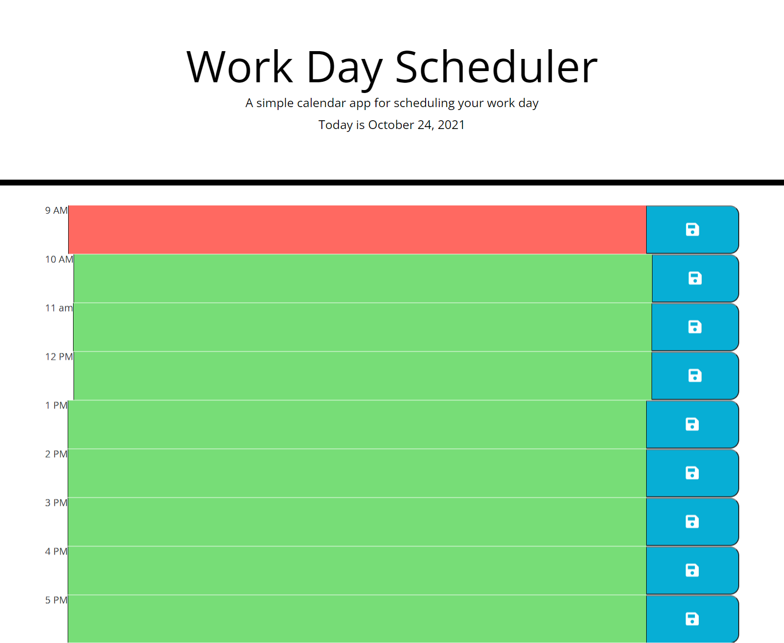

# Work Day Scheduler

# OBJECTIVE:
## Create a daily work scheduler that could easily enter activities and saved to local storage.

# Steps taken to meet these objectives:
* Date block added to the top to display the current day.
* Body was created using jQuery listing the var hours 9 to 5.
* Function written to distingush the difference between past furtue and present.
* Function written to display the times with text area.
* Save button added using icon of disc image to indicate save.

# Below are the GitHub Pages published link and Github Repository address:

https://bilcon.github.io/workday-scheduler/

https://github.com/bilcon/workday-scheduler

# Here is a screen shot of the webpage when deployed:

